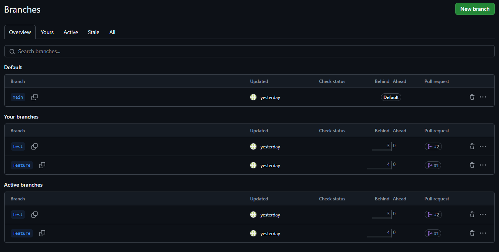
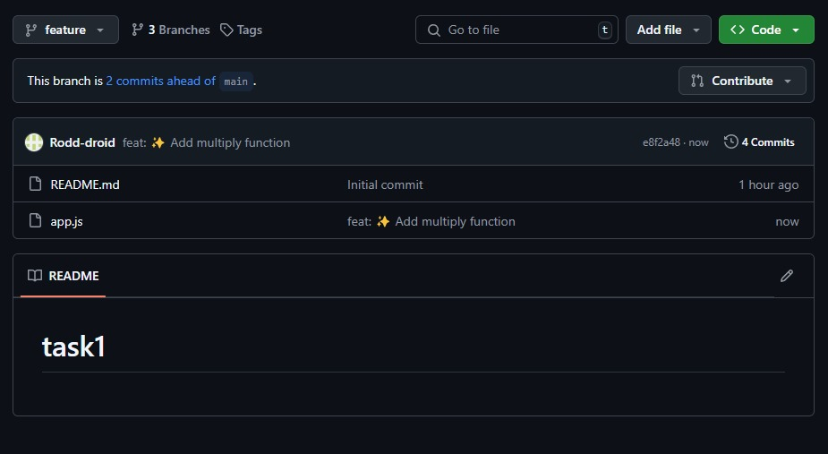
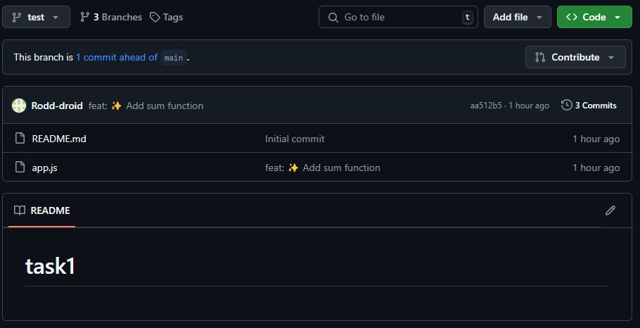
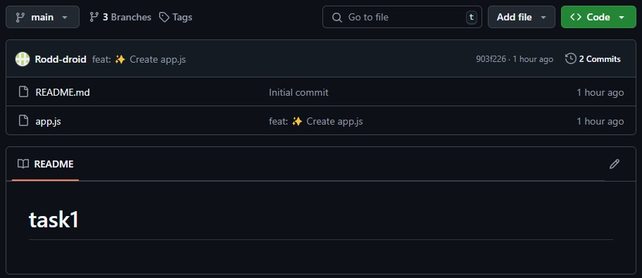
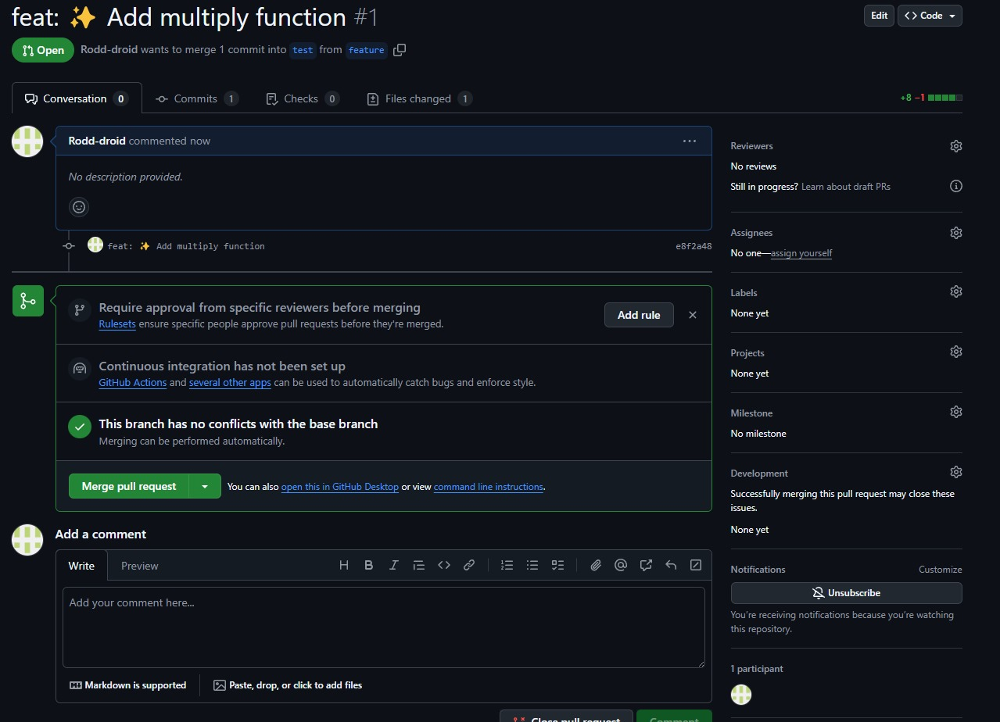
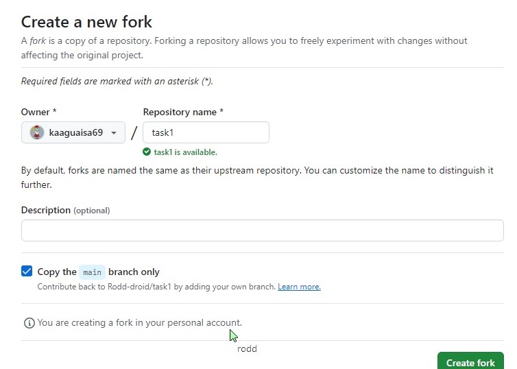
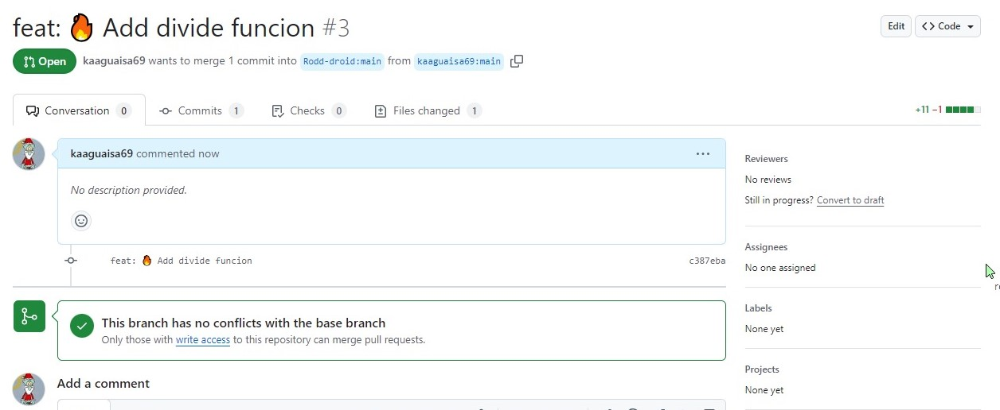
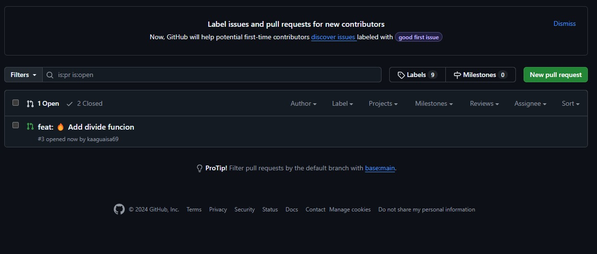
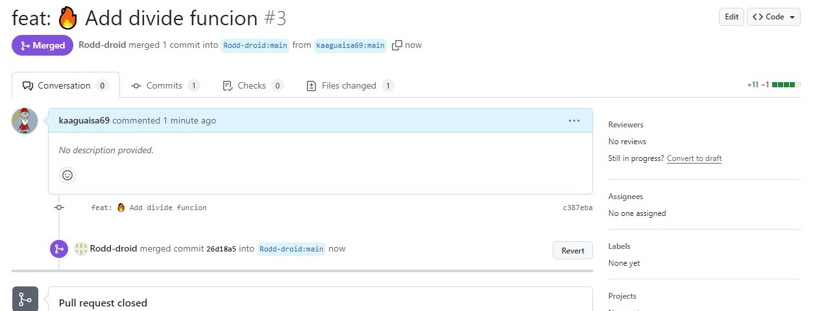

# task1

This is a simple JavaScript project that shows how to add, multiply, and divide numbers. It serves as practice for learning how to use branches, pull requests, and forks on GitHub.

## Project Structure
- **app.js**: Contains the `sum`, `multiply` and `divide` functions to perform basic math operations.

## Installation
1. Clone this repository:
   ```bash
   git clone https://github.com/tu-usuario/nombre-del-repo.git


2. Run file:
   ```bash
   app.js

## Screenshots











## Authors
- Bryan Quilumba
- Kevin Aguaisa